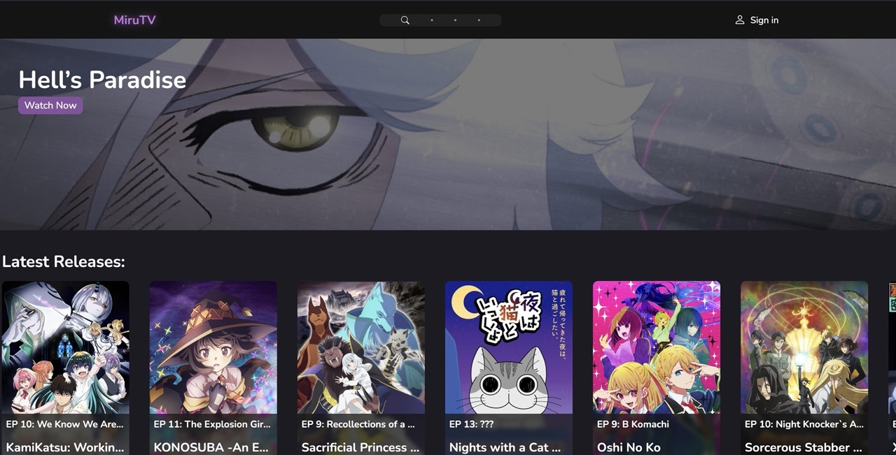

<h1 align="center">
    MiruTV
</h1>

## Introduction
> <i>Let's watch anime... Just Mi and Ru...</i>

MiruTV is a free Anime Streaming Site. So miru and chill with no worries of VPNs or weird H-Anime popups.

Want to save your favorite anime to your watchlist? Create an account and start binging!

> <i>No, I don't store your personal data. I even advise to not use your personal email as a username. For security reasons, I haven't added a recovery system for accounts. If there's plenty of [support](https://github.com/OatsProgramming/miruTV/issues/new/choose) for the feature, it will be added.</i>

<strong>This project is live! Check it out on [mirutv.vercel.app](https://mirutv.vercel.app/)</strong>

## Contributing
Got suggestions? See bugs? You can start a [discussion](https://github.com/OatsProgramming/miruTV/discussions) at the discussion bar or help [contributing](https://github.com/OatsProgramming/miruTV/pulls) to the project by creating a pull request. If there are any [issues](https://github.com/OatsProgramming/miruTV/issues/new/choose) that you'd like to report, just let me know! Anything helps :)

## Acknowledgements
This was made possible thanks to the [Enime API](https://docs.enime.moe/). If you're curious about the nit and grit details, you can check out the project [here](https://github.com/Enime-Project).

This was also made possible with [OPlayer](https://oplayer.vercel.app/): a beautiful, modern HTML5 video player that makes development a whole lot easier. You can check out their project [here](https://github.com/shiyiya/oplayer).